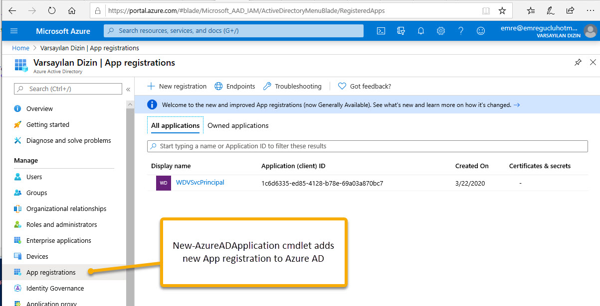

# Windows Virtual Desktop Deployment Walkthrough
 Step By Step Walkthrough to deploy Windows Virtual Desktop


1. Install required Modules

    ```PowerShell
    Install-Module AzureAD
    Install-Module -Name Microsoft.RDInfra.RDPowerShell
    ```
1. Grant Permissions to Windows Virtual Desktop
    - Register your AzureAD with the  [Windows Virtual Desktop Server App](https://login.microsoftonline.com/common/adminconsent?client_id=5a0aa725-4958-4b0c-80a9-34562e23f3b7&redirect_uri=https%3A%2F%2Frdweb.wvd.microsoft.com%2FRDWeb%2FConsentCallback)

    - Register your AzureAD with the  [Windows Virtual Desktop Client App](https://login.microsoftonline.com/common/adminconsent?client_id=fa4345a4-a730-4230-84a8-7d9651b86739&redirect_uri=https%3A%2F%2Frdweb.wvd.microsoft.com%2FRDWeb%2FConsentCallback)

1. Create a service principal in Azure Active Directory

    ```PowerShell
    Import-Module AzureAD
    $aadContext = Connect-AzureAD
    ```

1. Create an App Registration in AzureAD
    ```PowerShell
    $svcPrincipal = New-AzureADApplication -AvailableToOtherTenants $true -DisplayName "WDVSvcPrincipal"
    ```

    Once registered with the above PowerShell commands the registration appears in App Registrations on the portal.

    


1. Set the Credentials varbiles needed for Role Assignment
    ```PowerShell
    $svcPrincipalCreds = New-AzureADApplicationPasswordCredential -ObjectId $svcPrincipal.ObjectId
    $Password = $svcPrincipalCreds.Value
    $TenantID = $aadContext.TenantId.Guid
    $ApplicationID = $svcPrincipal.AppId
    ```

1. Create a role assignment in Windows Virtual Desktop Preview

    ```PowerShell
    Add-RdsAccount -DeploymentUrl "https://rdbroker.wvd.microsoft.com"
    Get-RdsTenant
    ```


